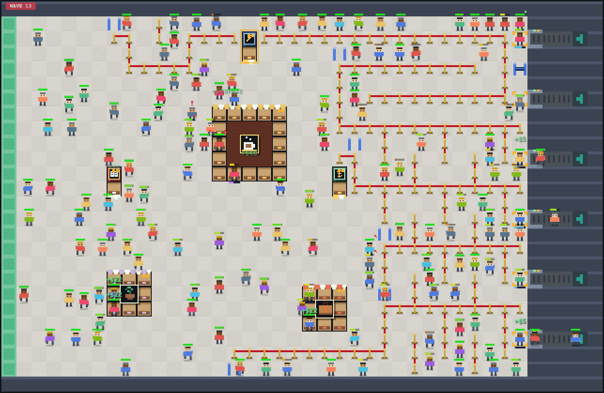

# Checkpoint!

Airport security queue sim. You never control the passengers — you control the **space**:
rope barriers, belt gates, checkpoint lanes, and a concourse mall. Autonomous pixel people
flow through whatever you design, and the design is what makes or breaks the day.



## The idea

Passengers get frustrated while standing still, but almost not at all while walking.
This is how real queues feel: time passes faster when you're moving. Being stuck in
a crowd makes frustration grow even faster.

Without barriers, people don't form lines. They cluster around the checkpoint, cut
ahead when there's a gap, and get in each other's way. You place rope barriers to
force them into single-file lines. A long snaking line keeps everyone moving a
little and calm. A crowd standing in a blob gets angry and people give up and leave.
The scanner works at the same speed either way — what you control is how the wait
feels.

The pathfinding treats people as obstacles with costs: walking behind someone going
the same way is cheap, pushing against a line is very expensive, and someone parked
at a counter costs however long they'll stay there.

## The day

Arrivals come as a staged rush ladder — each wave sized to pressure-test the next thing
you can afford. Serves pay a flat $5; walk-offs cost $25 and panic everyone nearby.
Spend it on:

- **Fences ($3)** and **gates ($15, free to toggle)** — queue geometry, the core tool
- **Checkpoints** (6 slots, each additional lane pricier) and **lane upgrades** (much
  faster scans, priced for the late game)
- **The mall** — six shops from coffee kiosk to duty-free anchor. Shops are bank _and_
  buffer: visitors spend money, bank patience, and pick up perks (faster walking,
  reading in line, pre-wrapped bags, storm saves). Upgrades grow counter seating until
  the whole storefront is open.

Each wave's first arrival is its **VIP** — serve them for a wave-scaled bonus. Two ways
to lose: end a wave bankrupt, or let too much of one wave's cohort storm off and the
authority shuts you down. Dying rich is a real failure mode.

## Run

```sh
pnpm install
pnpm dev        # play (vite dev server)
pnpm build      # type-check + production bundle to dist/
pnpm preview    # serve the production build
```

## Controls

- **F** fence tool (selected on load); **G** gate tool; **S** or **Esc** select — click
  lanes/shops to buy, sell, upgrade, drain; click gates to swing them open/shut (free)
- Click/drag places; right-click erases (full refund on fences and gates)
- **Space** pause · **1 / 2 / 3** speed 1× / 2× / 5×
- Hover a passenger to see where they're trying to go
